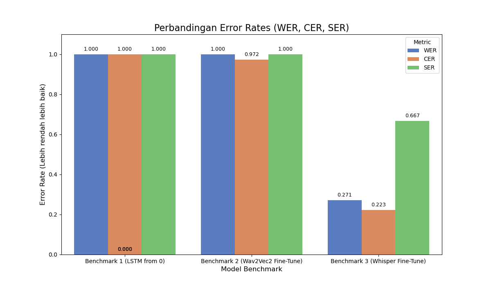
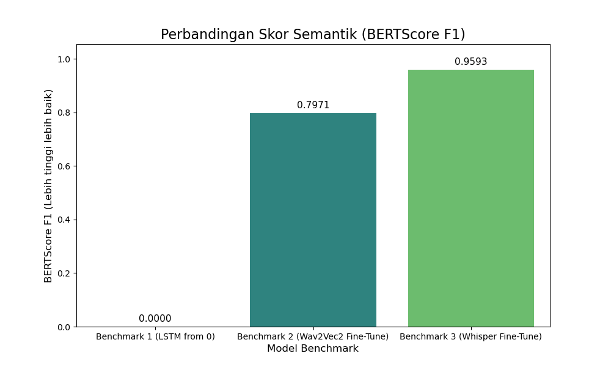

# Project 3: Automatic Speech Recognition (ASR)

Proyek ini adalah implementasi *end-to-end* dari pipeline **Spoken Language Understanding (SLU)**, sebagai bagian dari Portofolio Project 3 Indonesia AI.

Tujuan proyek ini adalah menyelesaikan dua tugas utama menggunakan dataset `en-US` dari **MINDS-14**:
1.  **Automatic Speech Recognition (ASR):** Mengubah audio ucapan menjadi teks.
2.  **Intent Classification:** Menentukan maksud (intensi) dari teks yang diucapkan.

---

## 🚀 Pipeline & benchmarks
Proyek ini dibagi menjadi dua pipeline utama:

1.  **Pipeline ASR (Audio-ke-Teks):** Tiga model benchmark dievaluasi untuk menemukan transkriptor terbaik.
2.  **Pipeline Intent Classification (Teks-ke-Intensi):** Sebuah model *classifier* dilatih untuk memprediksi 1 dari 14 intensi.

---

## 📊 Hasil Pipeline 1: Automatic Speech Recognition (ASR)

Kami membandingkan tiga pendekatan benchmark untuk ASR:
* **Benchmark 1 (LSTM from 0):** Model LSTM *bidirectional* yang dilatih dari nol menggunakan fitur **MFCC**.
* **Benchmark 2 (Wav2Vec2 Fine-Tune):** *Fine-tuning* pada model `facebook/wav2vec2-base-960h` (Self-Supervised).
* **Benchmark 3 (Whisper Fine-Tune):** *Fine-tuning* pada model `openai/whisper-tiny.en` (Supervised).

### Evaluasi ASR
Evaluasi dilakukan pada 57 sampel (10%) dari dataset `en-US` menggunakan 4 metrik.

| Benchmark | Model | WER (↓) | CER (↓) | SER (↓) | BERT-F1 (↑) |
| :--- | :--- | :--- | :--- | :--- | :--- |
| Benchmark 1 | LSTM (from 0) | 1.0000 | 1.0000 | 1.0000 | 0.0000 |
| Benchmark 2 | Wav2Vec2 | 1.0000 | 0.9725 | 1.0000 | 0.7971 |
| **Benchmark 3** | **Whisper** | **0.2713** | **0.2226** | **0.6667** | **0.9593** |

*(↓) = Semakin rendah semakin baik. (↑) = Semakin tinggi semakin baik.*

### Visualisasi Hasil ASR

**Perbandingan Error Rates (WER, CER, SER)**


**Perbandingan Skor Semantik (BERTScore F1)**


### Analisis ASR
1.  **LSTM & Wav2Vec2 (Gagal):** Melatih dari nol (LSTM) atau *fine-tuning* model *self-supervised* (Wav2Vec2) pada data ~500 sampel gagal total menghasilkan teks yang benar (WER 100%).
2.  **Whisper (Sukses):** **Whisper** adalah pemenang mutlak di semua metrik. Karena dilatih pada 680.000 jam data **berlabel**, model ini sudah "mengerti" bahasa Inggris dan berhasil di-*fine-tune* pada data kecil kita (WER 27.1%).

---

## 📊 Hasil Pipeline 2: Intent Classification (Teks-ke-Intensi)

Kami melatih model *classifier* (`bert-base-uncased`) untuk memprediksi 1 dari 14 intensi dari transkripsi. Kami menguji dua skenario:

1.  **Skenario 1 (Ideal):** Model BERT memprediksi intensi dari **teks asli** (transkripsi manusia).
2.  **Skenario 2 (Real-World):** *Pipeline* bertingkat (cascaded). Audio mentah -> **Whisper** -> Teks Prediksi -> **BERT** -> Prediksi Intensi.

### Evaluasi Intensi
Evaluasi dilakukan pada 57 sampel (10%) dari dataset `en-US`.

| Skenario | Pipeline | Akurasi (↑) |
| :--- | :--- | :--- |
| 1 (Ideal) | Teks Asli -> BERT | **0.9474 (94.7%)** |
| 2 (Real-World) | Audio -> Whisper -> BERT | **0.8947 (89.5%)** |

### Analisis Intensi
* Model *classifier* BERT sangat akurat (94.7%) jika diberi input teks yang sempurna.
* Pada *pipeline real-world*, terjadi penurunan akurasi **hanya 5.2%**.
* Ini membuktikan bahwa *pipeline* (Whisper + BERT) sangat **tangguh (robust)**. Meskipun ASR Whisper memiliki WER 27.1%, sebagian besar kesalahannya tidak mengubah makna semantik kalimat, sehingga BERT tetap dapat memprediksi intensi dengan benar.

---
## 📁 Struktur Repositori

Semua kode bersifat *reusable* dan dibagi menjadi beberapa skrip di dalam folder `src/`.

src/ ├── config_asr.py # File konfigurasi utama (paths, model names, params) 
     ├── utils_asr.py # Fungsi helper (cth: clean_text) │ 
     ├── 01_preprocess_mfcc.py # Preprocessing untuk Benchmark 1 (LSTM) 
     ├── 02_train_lstm.py # Skrip training untuk Benchmark 1 (LSTM) │ 
     ├── 03_preprocess_wav2vec2.py # Preprocessing untuk Benchmark 2 (Wav2Vec2) 
     ├── 04_train_wav2vec2.py # Skrip training untuk Benchmark 2 (Wav2Vec2) │ 
     ├── 05_preprocess_whisper.py # Preprocessing untuk Benchmark 3 (Whisper) 
     ├── 06_train_whisper.py # Skrip training untuk Benchmark 3 (Whisper) │ 
     ├── 07_evaluate_all.py # Skrip evaluasi akhir (ASR Benchmarks) │ 
     ├── 08_preprocess_intent.py # Preprocessing untuk Klasifikasi Intensi (BERT)
     ├── 09_train_intent.py # Skrip training untuk Klasifikasi Intensi (BERT)
     ├── 10_evaluate_intent.py # Skrip evaluasi akhit (Real-World SLU Pipeline)
     └── model_asr.py # Arsitektur model LSTM (from scratch)

---

## 🚀 Cara Menjalankan Proyek
*(Mirip dengan struktur Project 2)*

1.  **Clone dan Setup Environment:**
    ```bash
    git clone [URL_REPO_ANDA]
    cd [NAMA_FOLDER_REPO]
    pip install -r requirements.txt
    ```

2.  **Langkah 1: Jalankan Semua Preprocessing (Urut)**
    *(Ini akan membuat 4 folder data: `processed_data...`)*
    ```bash
    python src/01_preprocess_mfcc.py
    python src/03_preprocess_wav2vec2.py
    python src/05_preprocess_whisper.py
    python src/08_preprocess_intent.py
    ```

3.  **Langkah 2: Jalankan Semua Training (Gunakan GPU & Urut)**
    *(Ini akan membuat 4 folder model di dalam `models/`)*
    ```bash
    python src/02_train_lstm.py
    python src/04_train_wav2vec2.py
    python src/06_train_whisper.py
    python src/09_train_intent.py
    ```

4.  **Langkah 3: Jalankan Evaluasi Komparatif**
    *(Jalankan kedua skrip evaluasi)*
    ```bash
    # Evaluasi Pipeline ASR (Audio-ke-Teks)
    python src/07_evaluate_all.py
    
    # Evaluasi Pipeline SLU (Audio-ke-Intensi)
    python src/10_evaluate_intent_pipeline.py
    ```
    *(Skrip ini akan mencetak hasil akhir dan menyimpan 2 plot perbandingan)*

---

## 📦 Dependensi Utama
* `torch`
* `transformers`
* `datasets`
* `evaluate` (untuk metrik WER, CER, BERTScore)
* `librosa` (untuk MFCC)
* `pandas` & `seaborn` (untuk plotting)
* `psutil`